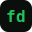

<div align="center">



# Faydev — Landing Page Jasa Pembuatan Website

**Jasa Web Developer & Software Developer untuk UMKM Indonesia**

[](https://www.php.net/)
[](https://www.mysql.com/)
[](LICENSE)

[Overview](#overview) · [Features](#features) · [Project structure](#project-structure) · [Getting started](#getting-started) · [API reference](#api-reference) · [Customization](#customization)

</div>

---

A lightweight, high-performance business landing page for **Faydev** (by Faris AY), a web development service specializing in websites, landing pages, automation, and WhatsApp chatbots for Indonesian SMBs (UMKM). Built with plain PHP + MySQL backend (projects gallery and social links APIs) and vanilla HTML/CSS/JavaScript — designed for shared hosting with no build tools required.

## Overview

The website serves as the primary business landing page for the **Faydev** web development service. Its purpose is to attract potential clients, clearly communicate available services and pricing, showcase completed projects, and funnel visitors toward a WhatsApp consultation CTA.

Key design choices:

- **No framework dependency** — plain PHP, CSS custom properties, and vanilla JS keep the codebase portable and hosting-agnostic.
- **Mobile-first** — layout and performance are optimised for mobile visitors first.
- **Database-driven where it matters** — the projects gallery and social links are stored in MySQL so they can be updated without touching HTML.

## Features

- **Hero section** with business tagline, and prominent dual CTAs (konsultasi gratis & lihat portofolio)
- **Services section** — 4 service cards: Web Development (company profile, e-commerce, CMS), Landing Page, Automation (Google Sheets, automated reports), and Chatbot WhatsApp
- **Pricing section** — 3 packages: Landing Page (Rp 1.5jt), Company Profile (Rp 2.5jt), and Custom Web (custom quote)
- **Testimonials / stats section** — social proof counters: 50+ projects, 99% client satisfaction, 100% on-time delivery
- **Dynamic project portfolio gallery** — latest projects fetched from the database via a PHP JSON API, with skeleton loaders and fallback placeholder images
- **About section** — company and founder introduction
- **Social links** — injected from database, with static fallbacks if the API is unavailable
- **Dark / Light theme toggle** — preference persisted in `localStorage`
- **WhatsApp CTA integration** — pre-filled links for instant consultation throughout the page
- **Scroll animations** and back-to-top button
- **SEO ready** — `<title>`, meta description, Open Graph, Twitter Card tags, JSON-LD structured data, `robots.txt`, and `sitemap.xml`

## Project structure

```
faydev.my.id/
├── index.php           # Single-page entry point (HTML + PHP date)
├── database.sql        # MySQL schema and seed data
├── robots.txt          # Crawler directives
├── sitemap.xml         # XML sitemap for search engines
├── includes/
│   └── db.php          # PDO connection helper (DB_HOST, DB_USER, DB_PASS, DB_NAME)
├── api/
│   ├── projects.php    # GET /api/projects.php?limit={n}  → JSON
│   └── social.php      # GET /api/social.php              → JSON
└── assets/
    ├── css/style.css   # All styles (CSS custom properties, dark/light themes)
    ├── js/main.js      # Theme toggle, typing animation, API fetching, animations
    └── images/         # favicon.svg, profile.jpg, og-image.jpg, project thumbnails
```

## Getting started

**Requirements:** PHP ≥ 7.4, MySQL ≥ 5.7, Apache (or the PHP built-in server), `pdo_mysql` extension enabled.

### 1. Set up the database

Import the provided schema and seed data:

```bash
# Using the MySQL CLI
mysql -u root -p < database.sql
```

Or import `database.sql` via phpMyAdmin: **Import → choose file → Go**.

The script creates the `fayd7716_project` database automatically.

### 2. Configure the database connection

Edit `includes/db.php` and update the constants to match your environment:

```php
define('DB_HOST', 'localhost');
define('DB_USER', 'your_db_user');
define('DB_PASS', 'your_db_password');
define('DB_NAME', 'fayd7716_project');
```

> [!WARNING]
> Credentials are currently hardcoded in `includes/db.php`. Do not commit production credentials to version control. Consider loading them from environment variables or a server-level config file before deploying to a public host.

### 3. Start the server

**XAMPP / Apache** — place the project inside your webroot and visit:

```
http://localhost/faydev.my.id/
```

**PHP built-in server** (development only):

```bash
php -S localhost:8000
# open http://localhost:8000/
```

### 4. Verify

- The page loads with a project gallery (six cards from the seed data).
- Switching the theme toggle persists across page reloads.
- Social icons in the contact section match the links seeded in `social_links`.

## Deployment

This project is designed for **shared hosting / cPanel**:

1. Upload all files to `public_html` (or a subdirectory).
2. Import `database.sql` via the hosting panel's phpMyAdmin.
3. Update `includes/db.php` with the remote database credentials.
4. Verify PHP's `pdo_mysql` extension is enabled (it is on virtually all cPanel hosts by default).

No build step, no Composer dependencies, no Node.js required.

## API reference

### `GET /api/projects.php`

Returns the latest projects ordered by date descending.

| Parameter | Type    | Default | Range |
|-----------|---------|---------|-------|
| `limit`   | integer | `6`     | 1–20  |

**Example response:**

```json
{
  "success": true,
  "data": [
    {
      "id": 1,
      "title": "Website Company Profile UMKM Kuliner",
      "thumbnail": "assets/images/projects/project-1.jpg",
      "demo_link": "https://demo.faydev.my.id/umkm-kuliner",
      "project_date": "2026-02-25"
    }
  ]
}
```

### `GET /api/social.php`

Returns all social media links ordered by insertion order.

**Example response:**

```json
{
  "success": true,
  "data": [
    { "id": 1, "name": "Instagram", "icon": "fab fa-instagram", "url": "https://instagram.com/faydev" }
  ]
}
```

Both endpoints return `{ "success": false, "message": "Database error" }` with HTTP 500 on failure.

## Customization

| What to change | Where |
|---|---|
| Business info, hero text, service offerings, pricing | `index.php` (hardcoded HTML) |
| WhatsApp number | All `wa.me/` links in `index.php` |
| Database credentials | `includes/db.php` |
| Project gallery entries | `projects` table in MySQL |
| Social media links | `social_links` table in MySQL |
| Colours and typography | CSS custom properties at the top of `assets/css/style.css` |
| Profile / brand photo | Replace `assets/images/profile.jpg` |
| OG / social share image | Replace `assets/images/og-image.jpg` |

> [!TIP]
> Social links and project thumbnails can be updated at any time through a MySQL client (phpMyAdmin, TablePlus, etc.) without touching source code. An admin panel for managing these is planned for a future iteration.

## Future development

Planned additions per the product spec:

- Admin panel (PHP + session login) for managing projects and social links without direct DB access
- Project detail pages at `/project/{slug}`
- `.env`-based configuration to avoid hardcoded credentials
